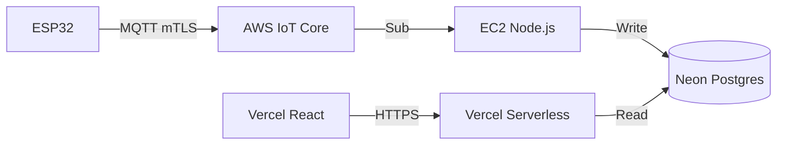

# Documentación Interna - KittyPau

⚠️ **CONFIDENCIAL:** Este archivo contiene detalles de arquitectura interna y seguridad. No publicar.

## Repositorios
*   **GitHub:** `https://github.com/kittypau-mascotas/kittypau_landingpage_2026`
*   **Vercel:** `https://vercel.com/kittypaus-projects/kittypau_landingpage_2026`

## Arquitectura Completa

## Flujo de Datos IoT

1.  **Dispositivo:** Publica JSON a `kittypau/{deviceId}/data`.
2.  **AWS IoT:** Valida certificado X.509 y reenvía al Bridge.
3.  **Bridge (EC2):**
    *   Valida esquema Zod.
    *   Inserta en `sensor_readings`.
    *   Actualiza `last_seen` en `devices`.
4.  **API (Vercel):** Lee de `sensor_readings` filtrando por `userId` (ownership).

## Decisiones Técnicas

*   **Bridge en EC2:** Necesario para mantener conexión MQTT persistente (Vercel no soporta esto).
*   **Neon Auth:** Se usa como proveedor de identidad base, pero la lógica de sesión la maneja Better Auth.
*   **Ownership:** Validación estricta `where userId = session.userId` en cada query.

## Roadmap

*   [ ] Alertas en tiempo real (WebSockets/SSE).
*   [ ] Integración con IA para análisis de comportamiento.
*   [ ] App móvil nativa.